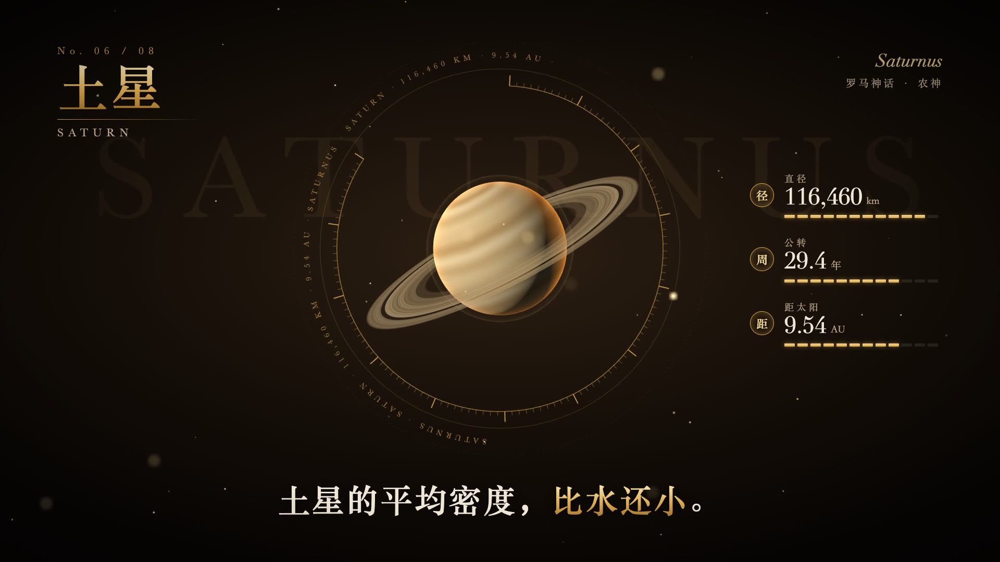

# Gold Noir Video Creator · 暗金风格视频制作 Skill

用 **Remotion + Three.js** 制作暗金风格的科普、知识讲解和主题介绍视频。包含可运行的 1080p 视频模板、3D 程序化纹理、逐字字幕、信息面板，以及由代码合成的配乐。

Skill 名称：`gold-noir-video-creator`。

## 效果预览

**60 秒完整示例 · 1080p · 含配乐**，点击下方播放器即可在本页观看。

https://github.com/user-attachments/assets/f1d7b2bf-9a94-4600-b136-dd671e94c8b9

**成片画面**



默认示例为 **60 秒太阳系科普视频**：封面（首帧即完整标题画面，并抛出开场问题）→ 八个行星段落 → 全景收尾。输出为 1920×1080、30fps 的 MP4，包含字幕与配乐，默认不含旁白；可选用 `npm run voice` 生成免费的 AI 旁白（edge-tts），旁白、字幕与画面逐句对齐；人声自动做后期处理以减轻 AI 味，配乐在说话时自动压低，选声音前可用 `npm run voice:samples` 生成试听对比，详见 [SKILL.md](SKILL.md) 的“配音”一节。

## 适合制作什么

- 暗金、黑金、深色电影感的科普视频。
- 以一个主题拆成多个段落的知识讲解视频。
- 复用金色衬线标题、3D 物体、刻度表盘和数据面板的系列视频。
- 一句一动作的线描小剧场：具象线描人物（警察、嫌疑人、西装礼帽）、红色章节印、年份里程表，适合推理型、故事型主题（`npm run dev` 里的 `Linework` 演示）。

换成咖啡、建筑、科技等主题时，需要一起调整文案、数据和物体模型；并非只输入一句话就能自动获得任意题材的完整视频。示例见 [examples.md](examples.md)，供 AI 执行的说明见 [SKILL.md](SKILL.md)。

## 环境要求

| 项目 | 要求 |
|---|---|
| Node.js | **22.x（至少 22.18.0）或 24+**；配乐脚本直接读取 TypeScript 内容配置，建议使用 Node.js 24 LTS |
| npm | 随 Node.js 安装；使用仓库中的 `package-lock.json` 执行 `npm ci` |
| 浏览器 | Remotion 首次渲染会下载 Chrome Headless Shell，需要联网及可用磁盘空间 |
| 图形环境 | 支持 WebGL；渲染命令已配置 `--gl=angle` |
| 字体 | macOS 优先使用 Songti SC / Baskerville / Didot；其他系统见下方说明 |
| ffmpeg | `npm run master`（响度标准化 / 变速）、配音的人声后期处理与试听对比需要；手动抽帧检查也会用到 |

Windows 建议使用 PowerShell 运行 npm 命令；macOS / Linux 可使用终端。字体和 WebGL 环境不同会影响最终画面，发布前应在目标机器抽帧检查。

## 安装为 Skill

先克隆仓库：

```bash
git clone https://github.com/cpp285/gold-noir-video-creator.git
cd gold-noir-video-creator
```

也可以下载 ZIP 并解压。保留 `SKILL.md`、`examples.md` 和整个 `template/`，将文件夹命名为 `gold-noir-video-creator`。

- **Claude Code**：放入 `~/.claude/skills/gold-noir-video-creator/`。
- **其他支持 SKILL.md 的工具**：按该工具的技能安装方式放入技能目录，保留完整目录结构。

调用示例：

> 使用 gold-noir-video-creator，制作一个暗金风格的太阳系科普视频，先给我分镜和代表帧，再渲染成片。

> 使用 gold-noir-video-creator，把模板改为介绍三种咖啡产地。采用可核实的数据，保留金色标题、信息面板和逐字字幕。

工具应根据实际加载的 `SKILL.md` 位置找到同级 `template/`，不依赖某个用户的安装路径。

## 直接运行模板

不安装 Skill 也可以使用。进入仓库中的 `template/`：

```bash
cd template
npm ci
npm run check
npm run dev                       # 打开 Remotion Studio，自动生成配乐
npm run still -- --frame=470       # 重新生成配乐、打包、输出 out/still.png
npm run render                    # 重新生成配乐、打包、输出 out/video.mp4
npm run master                    # 响度标准化到 -16 LUFS，输出 out/video-master.mp4（交付用）
```

若要建立独立项目，将 `template/` 的全部内容（包括隐藏文件和锁文件）复制到新的项目目录，再运行上述命令。Composition id 为 `Main`。

连续抽帧时可以复用上次打包结果：

```bash
npm run bundle
npm run still:cached -- --frame=300
npm run still:cached -- --frame=650
```

每次输出会覆盖 `out/still.png`，需要保留时请先另存。修改代码、数据或配乐后，应重新 `npm run bundle`；常规 `still` 和 `render` 命令会自动完成这一步。

## 修改内容、数量和时长

| 文件 | 修改内容 |
|---|---|
| `template/src/cinematic/data.ts` | `PLANETS` 内容、`FPS / HOOK / TITLE / SEG / CLOSE` 帧数、字体及配色 |
| `template/src/cinematic/SolarCinematic.tsx` | 开场、片名、收尾文案和场景编排 |
| `template/src/cinematic/Overlay.tsx` | 字幕、通用信息面板、表盘和标题效果 |
| `template/src/cinematic/Space3D.tsx` | 相机、灯光及物体模型 |
| `template/src/cinematic/textures.ts` | 程序化纹理 |
| `template/scripts/bgm.mjs` | 配器和音色；数量、时长、转场时间自动读取内容配置 |

增删 `PLANETS` 项目后，视频总时长、面板编号、配乐时长和收尾布局会同步更新。每项 `id` 应唯一；`texture` 用来选择内置行星纹理，可由不同项目复用。至少保留一项，帧率和各段帧数均须为正整数。

例如：保留 3 项，设置 `SEG = 180`，默认开场、标题和收尾不变，则总时长为 33.2 秒。修改后运行 `npm run render` 即可生成对应时长的视频和配乐。

场景内部入场、退场效果会随段落时长缩放。很短的段落会使字幕难以阅读；增加很多项目会让收尾标签拥挤，需要检查构图。更换主题时仍须修改主题文案和模型，不会自动生成新的知识内容。

## 字体与素材

字体采用系统字体回退，不随仓库分发字体文件。macOS 缺少某个字体时也可能触发回退。

- **Linux**：安装 Noto Serif CJK SC（例如发行版的 `fonts-noto-cjk` 包）及 Noto Serif，之后重新启动 Studio / 渲染进程。
- **Windows**：可安装 Noto Serif CJK SC / 思源宋体；已有的中易宋体也在回退列表中。
- 需要多台机器完全一致的画面时，统一安装同一套字体，并调整 `data.ts` 的字体优先级。

行星表面、云层、星环、辉光和配乐均由代码生成。画面中的大陆、轨道距离、物体大小和运动速度是风格化示意，不能作为真实地图或按比例天文模拟。天文数据和示例文字的参考资料见 [sources.md](sources.md)，换主题时应重新核对。

## 验证与发布

```bash
cd template
npm ci
npm run check
npm run still -- --frame=470
npm run render
```

`npm run check` 包含 TypeScript 检查，以及段落增删、音乐时长、WAV 格式和收尾布局的回归检查。它不能替代画面检查和实际试听。

本次验证环境为 macOS / Node.js 24.16.0 / npm 11.13.0：已通过干净目录的锁文件安装、TypeScript 检查、5 项回归检查、模板打包和完整 60 秒渲染，并对成片抽帧检查。Windows / Linux 尚未进行实机渲染验证。

仓库忽略 `node_modules/`、`build/`、`out/`、生成的 `bgm.wav`、环境文件和日志。README 使用 GitHub 视频附件在首页内嵌播放完整示例，静态画面直接显示。本仓库保留 `docs/preview.gif`、`docs/preview.jpg` 和 `docs/demo.mp4` 作为预览素材及原始示例；更新首页视频时，需要同时替换 README 中的视频附件地址。后续较大的成片建议放入 GitHub Release。

## 许可证

本仓库的技能文档和模板代码使用 [MIT License](LICENSE)，独立复制的模板也附带许可证。外部依赖和系统字体遵循各自许可证。

模板支持本地渲染，无需购买素材或调用付费生成 API；**Remotion 的使用仍受其自身许可条款约束**，是否需要付费取决于使用者及使用场景。参见 [Remotion License & Pricing](https://www.remotion.dev/docs/license/pricing)。
